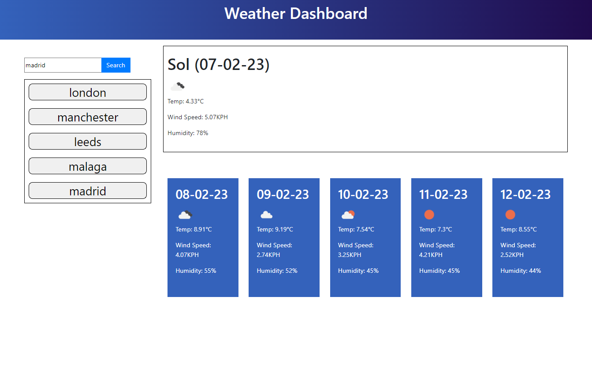

# 5DayWeatherForecastDashboard

## introduction
 In last week's lesson we  learned about third party apis. In this week's assignment we were challenged with taking two apis to produce a weather dashboard which produces a 5 day forecast.

The first api I implemented is called geocoding api which takes a city name and provides the longitude and latitude coordinates. With this information, I could make a call to Openweather api, passing the coordinates to return the weather for that area.The additional features we were asked to implement included saving previous searches to local storage. 
## Technologies
Project is created with HTML AND CSS AND JAVASCRIPT and includes 2 third party APIS

## Image of web page

## Link to live site

https://gpsnm.github.io/5DayWeatherForcastDashboard/

